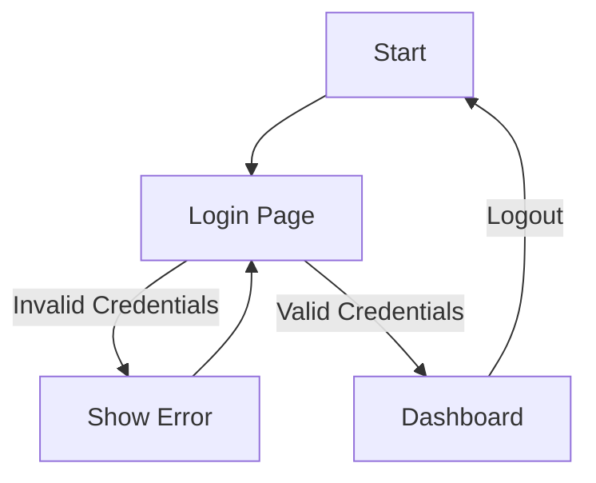
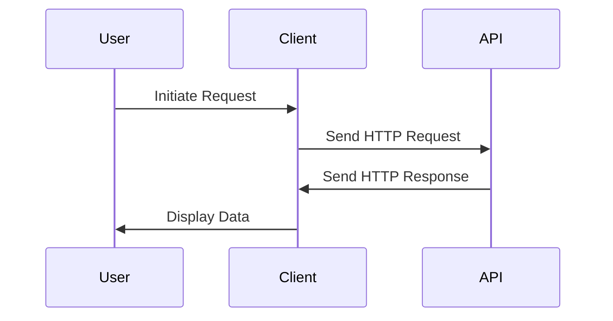
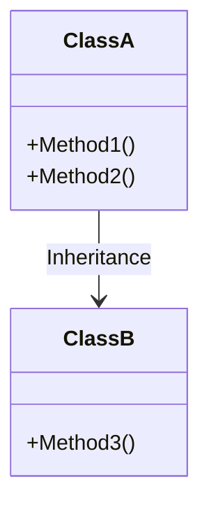
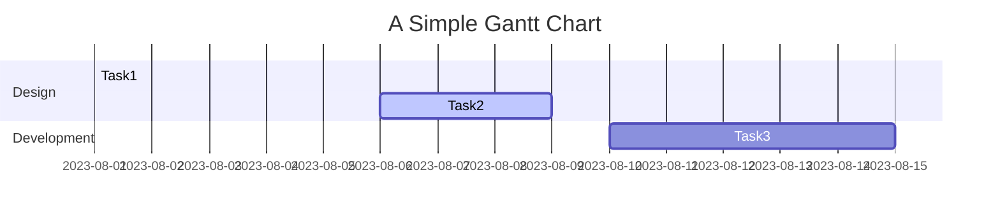
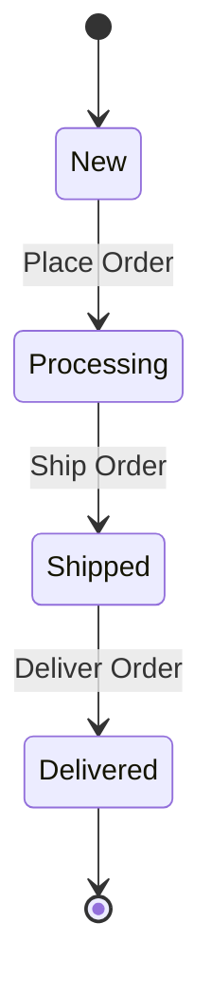

### 1. Flowchart for User Authentication

**Explanation**: This flowchart shows a basic user authentication process. The user starts at the "Login Page," and upon entering valid credentials, navigates to the "Dashboard." If the credentials are invalid, an error is shown, and the user is redirected back to the "Login Page."

---

### 2. Sequence Diagram for API Request-Response

**Explanation**: This sequence diagram illustrates a typical API request-response cycle. The user initiates a request through the client, which sends an HTTP request to the API. The API then responds, and the client displays the data to the user.

---

### 3. Class Diagram for Object-Oriented Design

**Explanation**: In this class diagram, `ClassA` and `ClassB` are involved in an inheritance relationship. `ClassA` has methods `Method1()` and `Method2()`, while `ClassB`, which inherits from `ClassA`, introduces a new method `Method3()`.

---

### 4. Gantt Chart for Project Management

**Explanation**: This Gantt chart outlines a project's timeline divided into "Design" and "Development" sections. It shows completed, active, and upcoming tasks along with their duration and start dates.

---

### 5. State Diagram for Order Management

**Explanation**: This state diagram represents an order management process, starting from a "New" state. After placing an order, it moves to "Processing," then to "Shipped," and finally to "Delivered," concluding the order process.
